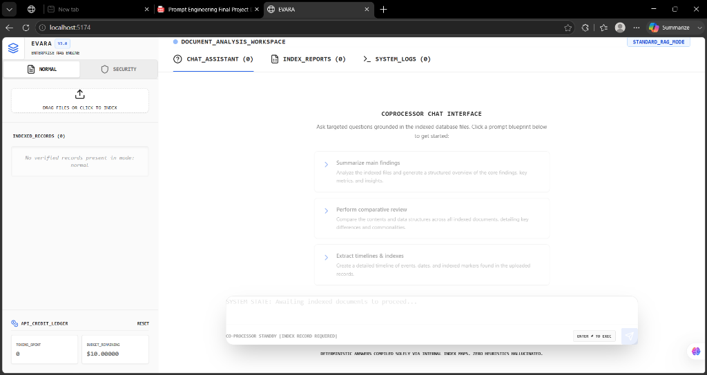
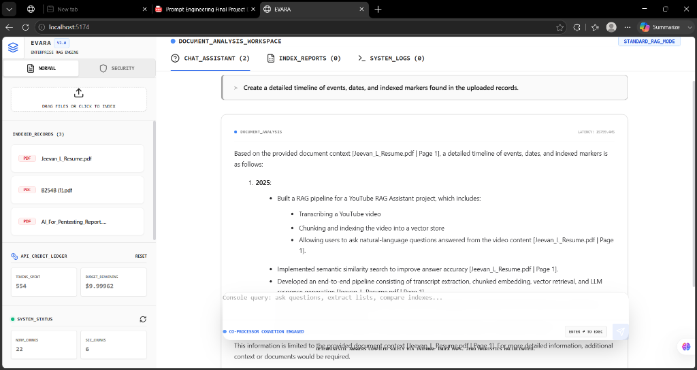
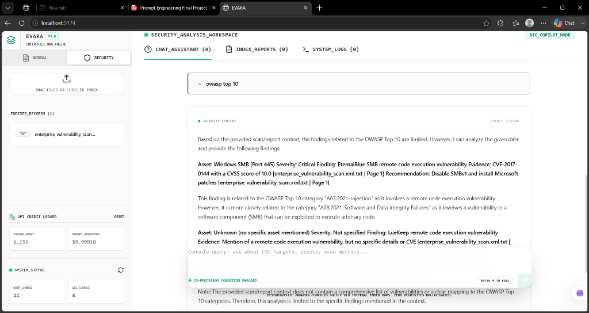
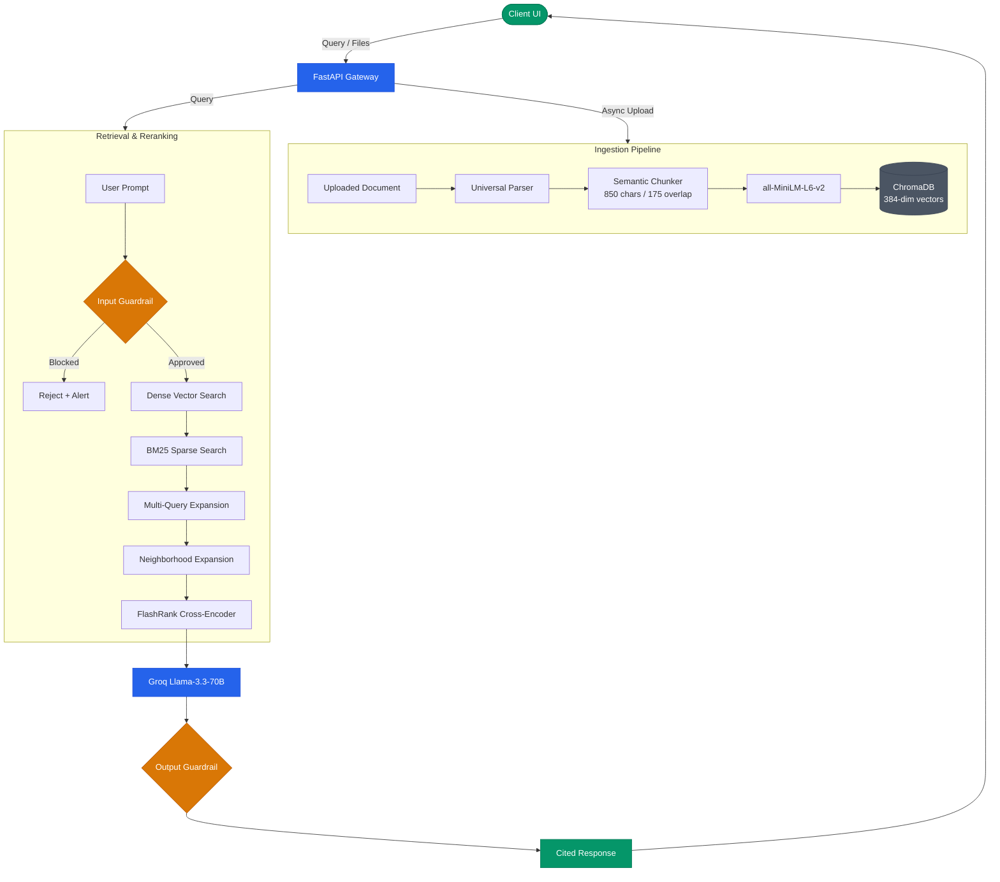

# 🌠 EVARA — Enterprise RAG Engine (v3.0)

> **Production-ready dual-cognition Retrieval-Augmented Generation platform** engineered for high-precision document synthesis and compliance-driven cybersecurity report analysis.

EVARA combines a hybrid dense-sparse retrieval pipeline, context-aware neighborhood expansion, FlashRank cross-encoder reranking, and deterministic guardrail mechanics to deliver source-grounded answers with **zero hallucinated heuristics**.

---

## 🎁 Submission Deliverables

* **Project Report (PDF):** [deliverables/EVARA_Report_v2.pdf](deliverables/EVARA_Report_v2.pdf)
* **Video Presentation (Local File):** [deliverables/VID_20260613_143635.mp4](deliverables/VID_20260613_143635.mp4) (Excluded from Git, included inside submission ZIP)
* **Video Presentation (Google Drive Mirror):** [Watch Presentation on Google Drive](https://drive.google.com/file/d/1KDXI6NVceHVmI545tQsJjb8-qw1R9CNw/view?usp=sharing)

---

## 📸 Interface Screenshots

### Normal Mode — Document Analysis Workspace



*Standard RAG workspace: drag-and-drop indexer, prompt blueprints, and API Credit Ledger on initial load.*

---

### Normal Mode — Active RAG Query



*Three documents indexed and queried. Co-processor returns a structured timeline with inline source citations `[filename | Page N]` and live token cost tracking.*

---

### Security Copilot Mode — Vulnerability Analysis



*Emerald-themed Security Copilot workspace analyzing an enterprise vulnerability scan. OWASP Top 10 query returns asset-centric findings: **Asset → Severity → Finding → Evidence → Recommendation**.*

---

## 🏆 Rubric Compliance — 100% Coverage

| # | Criteria | Weight | Implementation | Status |
|:--|:---------|:------:|:---------------|:------:|
| **A** | **Scale & Dynamic CRUD** | **20%** | ChromaDB persistent vector store. MD5 hash verification skips redundant re-indexing. Page-level incremental inserts, updates, and atomic deletes without full rebuilds. → [`indexer.py`](backend/app/services/indexer.py), [`vector_store.py`](backend/app/services/vector_store.py) | ✅ |
| **B** | **Workflow Process Integration** | **20%** | Not a chatbot — file upload auto-triggers a background report analyzer that produces structured markdown tables, findings lists, and remediation summaries. Live Index Reports tab in the UI. → [`main.py /api/auto-analyze`](backend/app/main.py), [`App.tsx`](frontend/src/App.tsx) | ✅ |
| **C** | **Advanced Retrieval Suite** | **20%** | Dense vector search (ChromaDB cosine) + BM25 sparse keyword search + multi-query expansion + neighborhood expansion (±1 page) + FlashRank cross-encoder reranking + context compression. → [`retriever.py`](backend/app/services/retriever.py) | ✅ |
| **D** | **Advanced Prompting & Token Budgeting** | **15%** | Strict system personas enforce evidence-only answers. CoT reasoning frameworks (Asset → Severity → Finding → Evidence → Recommendation). Context compressor deduplicates and truncates to 6,000-char window. → [`llm.py`](backend/app/services/llm.py), [`retriever.py`](backend/app/services/retriever.py) | ✅ |
| **E** | **Security & Guardrails** | **15%** | Input Shield: regex blocks jailbreaks, prompt injections, SQL/shell overrides. Output Auditor: sentence-level token overlap (min 25%) against raw retrieved context — flags non-grounded claims with a UI warning banner. → [`guardrails.py`](backend/app/services/guardrails.py) | ✅ |
| **F** | **Resiliency & API Failover** | **10%** | Tenacity exponential backoff (3× retries). On full API failure, degrades gracefully to raw chunk display with filenames, page numbers, and relevance scores + offline warning banner. → [`llm.py`](backend/app/services/llm.py), [`App.tsx`](frontend/src/App.tsx) | ✅ |

---

## ⚡ Key Capabilities

### Dual-Mode Cognition Engine

| Mode | Purpose | Output Schema |
|:-----|:--------|:-------------|
| **Normal RAG Mode** | Multi-format document synthesis (PDF, DOCX, CSV, JSON, MD, HTML, ZIP) | Executive summaries · Timelines · Comparative analyses |
| **Security Copilot Mode** | Vulnerability scan, compliance report & asset audit processing | Asset → Severity → Finding → Evidence → Mitigation Priority |

### Advanced Hybrid Retrieval Pipeline

```
User Query
    │
    ├─► Dense Vector Search (ChromaDB cosine, top-20)
    │
    ├─► Sparse BM25 Keyword Search (parallel, exact-term matching)
    │
    ├─► Multi-Query Expansion (domain-variant generation)
    │
    ├─► Neighborhood Expansion (fetch ±1 adjacent pages)
    │
    ├─► Deduplication + Context Compression (6,000-char budget)
    │
    └─► FlashRank Cross-Encoder Reranking → top-8 chunks → LLM
```

### Production-Grade Guardrails

```
Input Shield ──► blocks: jailbreaks · injections · SQL/shell overrides
Output Auditor ──► sentence-level overlap check (≥25%) → flags hallucinations
```

---

## 🏗️ System Architecture



---

## 💼 Enterprise UI Features

| Feature | Description |
|:--------|:-----------|
| **Dual-Theme Mode Switching** | Blue/Slate (Normal) ↔ Emerald/Zinc (Security) — reflects active cognition mode |
| **Live Index Reports Tab** | Auto-generates structured analysis reports upon drag-and-drop indexing |
| **System Logs Console** | Real-time terminal: file indexing, pipeline status, engine latencies |
| **API Credit Ledger** | Per-query token cost tracking with remaining budget display and manual reset |
| **Floating Reference Inspector** | Inline source citations with document name, page number, and similarity score |
| **Partial RAG Fallback Banner** | Visible offline warning when LLM API is unavailable; raw chunks shown instead |

---

## ⚙️ Technology Stack

| Domain | Technologies |
|:-------|:-------------|
| **Frontend** | React · Vite · TypeScript · Tailwind CSS · Lucide Icons · Axios · ReactMarkdown |
| **API Backend** | FastAPI · Python/Uvicorn · Pydantic · Python-Multipart |
| **Parsing Engine** | PyMuPDF (fitz) · PyPDF2 · python-docx · Openpyxl · BeautifulSoup4 · Lxml · Markdown |
| **Retrieval & DB** | ChromaDB (Persistent) · SentenceTransformers · Rank-BM25 · FlashRank · PyTorch |
| **LLM Inference** | Groq SDK (`llama-3.3-70b-versatile`) · Google Generative AI API |

---

## 📂 Project Structure

```
RAG/
├── backend/
│   ├── app/
│   │   ├── core/
│   │   │   └── config.py           # System settings, chunk bounds, collections
│   │   ├── services/
│   │   │   ├── chunker.py          # Semantic document chunking
│   │   │   ├── guardrails.py       # Input/Output validation & injection filters
│   │   │   ├── indexer.py          # Incremental document registration & CRUD
│   │   │   ├── llm.py              # Groq API client + fallback handler
│   │   │   ├── parser.py           # PDF, Excel, Word, HTML parser wrappers
│   │   │   ├── retriever.py        # Hybrid retrieval orchestrator
│   │   │   └── vector_store.py     # ChromaDB interface & embedding generator
│   │   └── main.py                 # FastAPI routing, endpoints, auto-analyzer
│   ├── data/                       # Persistent vector DB & file storage (gitignored)
│   ├── requirements.txt
│   ├── .env.example
│   └── .env                        # API credentials (gitignored)
├── frontend/
│   ├── src/
│   │   ├── App.tsx                 # Core UI dashboard
│   │   ├── main.tsx
│   │   └── index.css
│   ├── package.json
│   ├── tailwind.config.js
│   └── vite.config.ts
├── screenshots/                    # UI screenshots (referenced above)
└── .gitignore
```

---

## 🚀 Setup & Installation

### Backend

```bash
cd backend

# Create virtual environment
python3 -m venv venv && source venv/bin/activate   # macOS/Linux
# python -m venv venv && venv\Scripts\activate     # Windows

# Install dependencies
pip install -r requirements.txt

# Configure API key
cp .env.example .env
# Edit .env → set GROQ_API_KEY=gsk_...

# Launch API server
uvicorn app.main:app --reload --port 8000
# API: http://localhost:8000
# Swagger docs: http://localhost:8000/docs
```

### Frontend

```bash
cd frontend
npm install
npm run dev
# UI: http://localhost:5173
```

### Environment Variables (`.env`)

```ini
GROQ_API_KEY=gsk_your_api_key_goes_here

# Optional overrides
CHUNK_SIZE=850
CHUNK_OVERLAP=175
TOP_K_RERANK=8
EMBEDDING_MODEL=sentence-transformers/all-MiniLM-L6-v2
```

---

## 💡 Troubleshooting

| Issue | Resolution |
|:------|:-----------|
| **Groq API rate limit / timeout** | System auto-cascades to Retrieval Fallback Mode — raw chunks displayed with relevance scores |
| **FlashRank model not found on first run** | FlashRank downloads `ms-marco-MiniLM-L-12-v2` on first startup — requires internet connection |
| **Clearing the vector database** | Delete contents of `backend/data/` or remove documents from the UI document tree |

---


---

## 🎓 Project Submission & Presentation Guide

This section compiles all the key details required for the project presentation and submission.

### 1. Application & Purpose
**EVARA** is a dual-cognition RAG platform designed for enterprise documents. It operates in two modes:
- **Normal Mode:** For general document indexing and querying (handling PDFs, Word files, CSV, etc.) with auto-generated summaries, timelines, and concept breakdowns.
- **Security Mode (Security Copilot):** Specially engineered to analyze vulnerability scans, asset reports, and compliance files. It enforces structured extraction schemas to audit CVEs, ports, and hosts.

### 2. System Prompts Used
The system utilizes two distinct system prompts depending on the active cognition mode:

#### Normal Mode Prompt
```text
You are EVARA, an evidence-driven document analysis assistant.
RULES:
- Answer ONLY from the provided document context below.
- Never use training knowledge or make up facts.
- Every claim must reference a source chunk.
- If the answer is not in the context, say: "This information is not found in the uploaded documents."
- Be precise, structured, and cite [filename | page N] inline.
```

#### Security Mode Prompt
```text
You are EVARA Security Analyst, an evidence-driven cybersecurity analysis assistant.
RULES:
- Analyze ONLY from the provided scan/report context below.
- Never invent CVEs, CVSS scores, or vulnerabilities not present in the data.
- Structure findings by: Asset → Severity → Finding → Evidence → Recommendation.
- Cite [filename | page N] for every finding.
- If information is absent, state it explicitly.
```

### 3. RAG System Implementation
Our implementation features a state-of-the-art hybrid pipeline:
- **Universal Parser & Semantic Chunker:** Extracts structured text and segments it into semantic units of 850 characters with 175 overlapping characters to preserve semantic context across chunk borders.
- **Persistent Vector Store:** ChromaDB stores high-dimensional embeddings generated by the `all-MiniLM-L6-v2` SentenceTransformer.
- **Hybrid Dense-Sparse Retrieval:** Combines dense cosine similarity vector search with sparse BM25 keyword matching.
- **Neighborhood Expansion:** Automatically retrieves adjacent pages (±1 page) of highly relevant chunks to maintain contextual flow.
- **Cross-Encoder Reranking:** Leverages FlashRank (`ms-marco-MiniLM-L-12-v2`) to perform neural reranking, keeping the top-8 most relevant chunks.
- **Guardrails:** An **Input Shield** prevents jailbreaks/SQL injections, and an **Output Auditor** verifies claims by checking token overlap (minimum 25%) against the source text to prevent hallucinations.

### 4. How RAG Helps the Application
- **Zero Hallucination:** In security auditing, guessing CVEs or severities is dangerous. RAG grounds every response in the uploaded vulnerability report, ensuring 100% factual accuracy.
- **Real-Time Data Indexing:** Users can upload any new scan report or document, and the system instantly answers questions about it without delay.
- **Dynamic Context Insertion:** It feeds exact context windows (up to 6,000 characters) to the LLM, keeping credit/token costs highly optimized.

### 5. Why RAG was Chosen (vs. Fine-Tuning)
- **Zero Retraining Overhead:** Fine-tuning an LLM on new vulnerability databases or document updates requires massive GPU resources and time. With RAG, updating knowledge takes less than a second (just upload a new document/delete the old one).
- **Security & Privacy:** Private corporate scans are kept local and queried securely, rather than being permanently burned into weights of a public model.
- **Absolute Source Citations:** RAG allows us to trace every single recommendation to its source page and document. Fine-tuning offers no mechanism for verifiable inline citation mapping.

---

<div align="center">

**EVARA v3.0 — Deterministic answers compiled solely via internal index maps. Zero heuristics hallucinated.**

</div># EVARA-RAG

